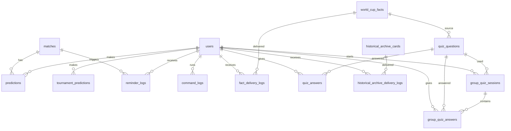
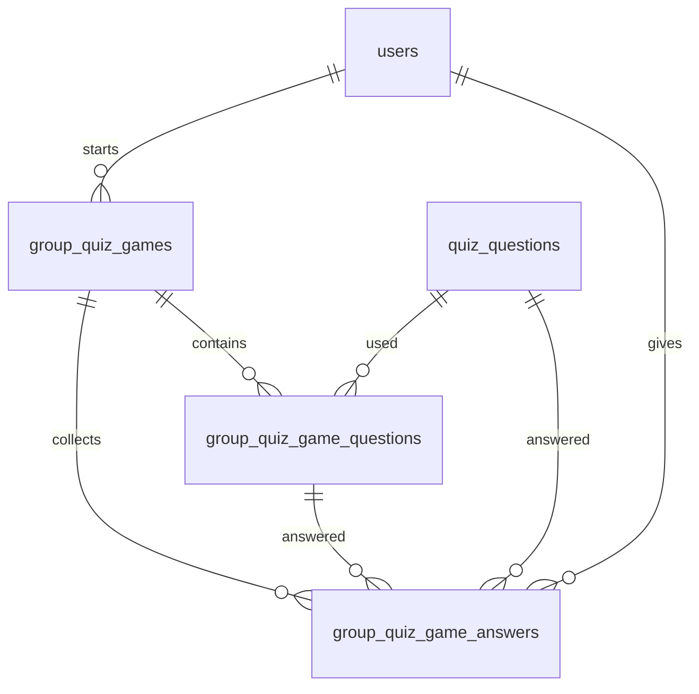

# Схема БД «Отец прогнозов»

Документ описывает текущую схему БД проекта на основе `app/models.py`.

## ER-диаграмма



## Основные таблицы

### `users`

Участники турнира и администраторы.

Ключевые поля:

| Поле | Описание |
|---|---|
| `telegram_id` | Telegram ID пользователя, уникальный |
| `username` | username из Telegram |
| `display_name` | отображаемое имя |
| `is_admin` | админский флаг |
| `created_at` | дата регистрации |

---

### `matches`

Матчи турнира.

Ключевые поля:

| Поле | Описание |
|---|---|
| `tournament_code` | код турнира, например `wc2026` |
| `home_team`, `away_team` | отображаемые названия команд |
| `home_team_api_name`, `away_team_api_name` | названия из API-Football |
| `stage` | стадия: `group`, `round_of_32`, `final` и т.д. |
| `match_round` | тур/раунд |
| `group_code` | группа |
| `starts_at` | дата и время старта |
| `score_home`, `score_away` | фактический счет |
| `winner_side` | `home`/`away` для плей-офф |
| `is_finished` | завершен ли матч |
| `external_fixture_id` | ID матча во внешнем API |

---

### `predictions`

Прогнозы участников на матчи.

Особенности:

- один прогноз пользователя на один матч;
- уникальность задается `uq_user_match_prediction`;
- для плей-офф поддерживается прогноз на проход.

Ключевые поля:

| Поле | Описание |
|---|---|
| `user_id` | участник |
| `match_id` | матч |
| `pred_home`, `pred_away` | прогноз счета |
| `advancement_bet_enabled` | включена ли ставка на проход |
| `predicted_advancing_side` | кто пройдет |
| `score_points` | очки за счет/исход |
| `advancement_points` | очки за проход |
| `points` | итоговые очки за матч |

---

### `tournament_predictions`

Долгосрочные прогнозы участников на итоги турнира.

Уникальность:

```text
user_id + tournament_code
```

Поля:

| Поле | Описание |
|---|---|
| `champion` | чемпион |
| `runner_up` | финалист |
| `third_place` | третье место |
| `top_scorer` | лучший бомбардир |
| `*_points` | очки по каждому пункту |
| `points` | сумма |

---

### `tournament_results`

Финальные итоги турнира для начисления очков за долгосрочные прогнозы.

---

## Факты и ежедневная рубрика

### `world_cup_facts`

База фактов о чемпионатах мира.

Поля:

| Поле | Описание |
|---|---|
| `external_id` | ID из seed-файла |
| `title` | заголовок |
| `fact_text` | текст факта |
| `category` | категория |
| `tournament_year` | год турнира |
| `source_text`, `source_url` | источник |
| `spicy_comment` | комментарий Отца прогнозов |
| `needs_verification` | требует проверки |
| `is_active` | активен ли факт |

### `fact_delivery_logs`

Логи отправки фактов пользователям или в группу.

---

## Квиз

### `quiz_questions`

Вопросы квиза.

Поля:

| Поле | Описание |
|---|---|
| `external_id` | ID из seed-файла |
| `question_text` | текст вопроса |
| `option_a`...`option_d` | варианты ответов |
| `correct_option` | правильный вариант |
| `explanation` | пояснение |
| `category` | категория |
| `source_fact_id` | связанный факт |

### `quiz_answers`

Индивидуальные ответы участников.

### `group_quiz_sessions`

Сессии группового квиза в общем чате.

### `group_quiz_answers`

Ответы участников в рамках групповой сессии.  
Один пользователь может ответить один раз в рамках одной сессии.

---

## Архив прошлых турниров

### `historical_archive_cards`

Архивные карточки по ЧМ-2022, ЧЕ-2024 и другим историческим эпизодам «Отца прогнозов».

### `historical_archive_delivery_logs`

Логи отправки архивных карточек.

---

## Технические таблицы

### `command_logs`

Логирование вызовов команд.

Используется для админской статистики:

```text
/admin_commands_stats
/admin_commands_today
```

### `reminder_logs`

Логи отправленных напоминаний, чтобы бот не дублировал одно и то же напоминание.

---

## Bootstrap SQL

Полная схема создания таблиц:

```text
db/schema.sql
```

Проверка текущей БД:

```bash
python scripts/check_db_schema.py
```

---

## Серия группового квиза с таймером

Для команды `/quiz_battle` добавлены отдельные таблицы. Они не заменяют текущие
`group_quiz_sessions` / `group_quiz_answers`, которые используются для одиночного
группового вопроса через `/quiz`.

### `group_quiz_games`

Одна сессия квиз-баттла в групповом чате.

| Поле | Описание |
|---|---|
| `chat_id` | ID группового чата Telegram |
| `status` | `setup`, `running`, `finished` |
| `questions_total` | количество вопросов: 3, 5 или 10 |
| `current_question_index` | текущий номер вопроса |
| `seconds_per_question` | время на ответ, сейчас 60 секунд |
| `started_by_user_id` | кто запустил баттл |
| `started_at`, `finished_at` | время старта и завершения |

### `group_quiz_game_questions`

Список вопросов внутри одной серии.

| Поле | Описание |
|---|---|
| `game_id` | ссылка на `group_quiz_games` |
| `quiz_question_id` | вопрос из `quiz_questions` |
| `question_order` | номер вопроса в серии |
| `message_id` | сообщение Telegram с вопросом |
| `opened_at`, `closed_at` | окно приема ответов |
| `status` | `pending`, `open`, `closed` |

### `group_quiz_game_answers`

Ответы участников на вопросы квиз-баттла.

| Поле | Описание |
|---|---|
| `game_id` | ссылка на игру |
| `game_question_id` | конкретный вопрос серии |
| `quiz_question_id` | вопрос из общей базы |
| `user_id`, `telegram_id`, `display_name` | участник |
| `selected_option` | выбранный вариант A/B/C/D |
| `is_correct` | правильный ли ответ |
| `answer_seconds` | скорость ответа в секундах |

Ограничение:

```text
uq_group_quiz_game_question_user
```

Один участник может ответить на один вопрос серии только один раз.

### Mermaid дополнение


